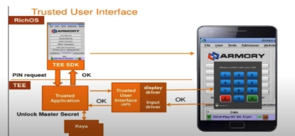

1  TrustZone ARM Cortex-A 

1. Overview: 

ARM  TrustZone  is  a  hardware  isolation  mechanism  technology  integrated  into  the  CPU architecture aimed at securing end devices by partitioning them into two separate execution environments: the "Secure World" and the "Normal World". This allows the operating system and applications  to  run  in  a  less  privileged  environment,  while  sensitive  operations  (such  as cryptographic functions or secure boot) run in a more secure environment. For example, for an application that takes in a secure password, the system would run anything else that does not need to be secure on the non-secure world, and the secured operations like the password input would be ran on the secure world as shown in[ Figure 1.](#_page0_x69.00_y400.00) 

*Figure 1 pin request being ran on secure world in an example application. [1]* 

What happens is typically called, an SMC call, where the non-secure world calls the monitor mode to do a context switch between the two worlds. The monitor mode is a high priority interrupt handler and gatekeeper between the two worlds. It would handle all interrupts to be configured to the non-secure or secure worlds, and it would also do the context switching between the two worlds. In the example shown in[ Figure 1,](#_page0_x69.00_y400.00) what would essentially happen is that the non-secure operation would do a Secure Monitor Call (SMC) that changes the operation to the monitor for it to then change it into the secure world. All context switching mechanisms like saving states and loading them are managed by the monitor mode. Shown in[ Figure 2 ](#_page0_x69.00_y705.00)is an overview of the system’s architecture. 

*Figure 2 TrustZone conceptional architecture. [1]* 

2. Complexity: 

TrustZone is conceptually straightforward but can be complex to implement correctly. It requires not just hardware support but also software that's aware of the secure/non-secure partitioning. This often  includes  a  Trusted  Execution  Environment  (TEE)  running  in  the  Secure  World,  and corresponding modifications to the OS running in the Normal World. And also requiring the context switching and all interruptions to be routed to the monitor mode. 

3. Security: 

TrustZone aims to provide a secure environment for code execution by isolating the Secure World from the Normal World. While this doesn't make a system 100% secure, it provides an extra layer of security that is difficult to penetrate when implemented correctly. Another mechanism that should be coupled with TrustZone is the secure boot, secure boot is the mechanism where the system would only be booted if its verified using the root of trust, which is a sequence of hashing and verification when system is booting to know what’s trusted and what isn’t. this concept is illustrated in[ Figure 3.](#_page1_x69.00_y444.00) 

*Figure 3 the secure boot mechanism's trust method. [1]*

4. General requirements: 
   1. Hardware: ARM Cortex-A series CPUs with TrustZone technology. 
   1. Software: Operating system and applications that are TrustZone-aware. 
4. Existing solutions: 

There are several existing solutions that leverage ARM TrustZone. This includes commercial TEEs like Trustonic's Kinibi, open-source options like OP-TEE, and various OS-level integrations. 

6. Advantages: 
- Enhanced Security: Isolated execution for secure tasks. 
- Flexibility: Allows for both secure and non-secure code to run on the same device. 
- Scalability: Can be implemented in various use-cases, from IoT devices to servers. 
- Cost: less costly than using a separate CPU for security. 
7. Disadvantages: 
- Complexity: Requires specialized knowledge and hardware and OS for correct implementation 
- Potential for Exploits: If improperly implemented, the secure environment can still be compromised. This is especially shown in DMA attacks where the connected device to the DMA is not supporting the implementation to protect the RAM from access. And thus, DMA can be used to inject code into the monitor mode. [2] 
- Performance Overhead: The context switch between Secure and Normal Worlds can add latency 
- Unprotected RAM: can be exploited via physical tampering, cold boot attacks could still work. 
- Incomplete  Security  Measures:  Trustlets,  which  are  secure  applications  running  within TrustZone, may lack built-in security features like stack cookies, which protect against buffer overflows, and Address Space Layout Randomization (ASLR), which randomizes the location of processes in memory to make exploits more difficult to execute. As demonstrated in some exploits, the absence of these protective measures makes it easier for attackers to compromise the secure environment [3]. 
8. Implantation: 

Implementation  involves  setting  up  a  TEE,  making  the  OS  TrustZone-aware,  and  carefully partitioning your application's functionality between the Secure and Normal Worlds. Proper care must be taken to ensure that sensitive data is never exposed to the Normal World, even during inter-process communication. Security audits and extensive testing are highly recommended. The monitor mode is used during these switches, where it handles all interrupts. Data would be protected by the supported Memory Management Units (MMU) in the system. And therefore, an interrupt would occur if a non-secure world operation tries to access a secure world memory location as shown in[ Figure 4 ](#_page2_x69.00_y699.00)where some pages are allocated for secure world and others are for non-secure world and the MMU would manage the entry to the pages in the memory. 

*Figure 4 implementation of the TrustZone in the MMU and memory. [1]* 

9. References: 

**1-**  Course name: **NOC:Information Security - 5 - Secure Systems Engineering, IIT** 

**Madras,** By Prof. Chester Rebeiro. Available at:[ https://nptel.ac.in/courses/106106199** ](https://nptel.ac.in/courses/106106199)

2-  [1] R. Stajnrod, R. B. Yehuda, and N. J. Zaidenberg, “Attacking trustzone on devices 

lacking memory protection - journal of computer virology and hacking techniques,” SpringerLink, https://link.springer.com/article/10.1007/s11416-021-00413-y (accessed Sep. 14, 2023). 

3-  [1] F. Raynal, “Attacking the arm’s Trustzone,” Quarkslabs blog ATOM, 

https://blog.quarkslab.com/attacking-the-arms-trustzone.html (accessed Sep. 14, 2023). 

10. Appendix I: 

 Definitions: 

Trusted execution environment (TEE): a hardware and software setup that allows for two separate partitions(secure world and non-secure world, communicating via monitor) on computer hardware for security. 

Enclave: used for intel Trusted environment where only some pages is secure (secure islands) using firmware. Root of trust: a sequence of hashing and verification when system is booting to know what’s trusted and what isn’t. Cold attack: access to RAM and getting data. 

Specter attack: access to cache and getting data. 

Page abort: happens for intel trusted environment when a non-enclave process tries to access an enclave page. 

Memory hierarchy: the fact that the processer loads a lot of stuff on the cache when it shouldn’t 😕 (for performance purposes). 

TPM trusted platform module: a hardware unit used to store keys, evolves to trusted environment. 

Sealing a key: encrypting key in TPM and saving the system state when this happened to verify later using config registers. 

Secure boot: booting firmware only if OS is digitally signed. 

Confidential computing: protection of data in use (in memory) by performing computation in a hardware-based TEE. 
